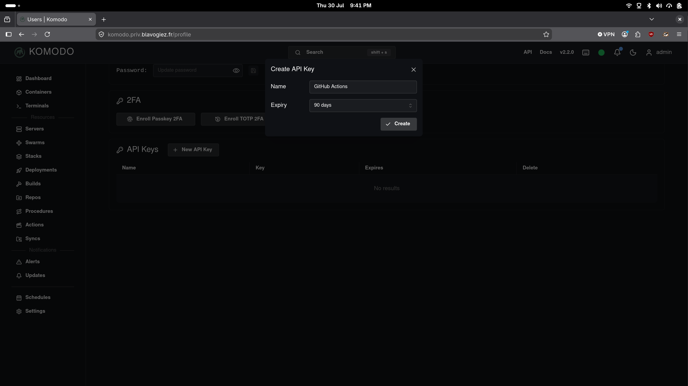

# Auto-deploying a container stack with a domain on Komodo, in 1 file and ~15 seconds

Check [demo repository that calls this repo Action](https://github.com/blavogiez-org/komodo-action-poc)

# Secrets needed and their obtention

- KOMODO_SERVER
- Git account (configured in Komodo)
- KOMODO_API_KEY
- KOMODO_API_SECRET

## Komodo server

Name of the server attached to Komodo that Komodo will deploy on (If you don't have one attached, use "Local")

## Git account

- Create a GitHub personal access token (if you deploy private repositories)

- Insert this token in Komodo

## Komodo API Key and API Secret

- Create API Key in Komodo, which also gives you the API Secret

## Use the secrets

You can use them in a GitHub org to spread them easily through new repos (less manual configuration) 